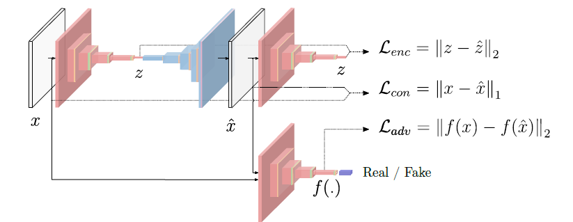

## Anomaly Detection with seqGAN + RL

### Models
#### CNN + DNN
`python3 basecnn.py `
#### SR + CNN + DNN
`python3 srcnn.py `
#### CLSTM + DNN
`python3 baselstm.py `
#### SR + CLSDN + DNN
`python3 srlstm.py `
#### GAN + DNN
`python3 baseGan.py `
#### WGAN
`python3 baseWgan.py `
#### WGAN-GP
`python3 baseWgan-gp.py `
#### AutoEncoder + GANomaly
`python3 GANomaly.py `

Overall model: AutoEncoder + GAN + DNN

### Data

We use the Yahoo Webscope S5 dataset, which is provided as part of the Yahoo! Webscope program. It consists of four classes and we only utilize the A1 class. A1 class is a sequence of data with only one feature arranged in time series. Sliding window algorithm is used for extracting data sequences with time features. Implementation details can be seen in DataLoader.py

### Experiment

We did experiements on cnn, dcgan,clstm, wgan, wgan-gp, ganomaly  with SR or not .

### How  to use

To train and test different model, run the python script mentioned above. In GAN models, if you want to use SR ,set the usr = True in dataloader.

